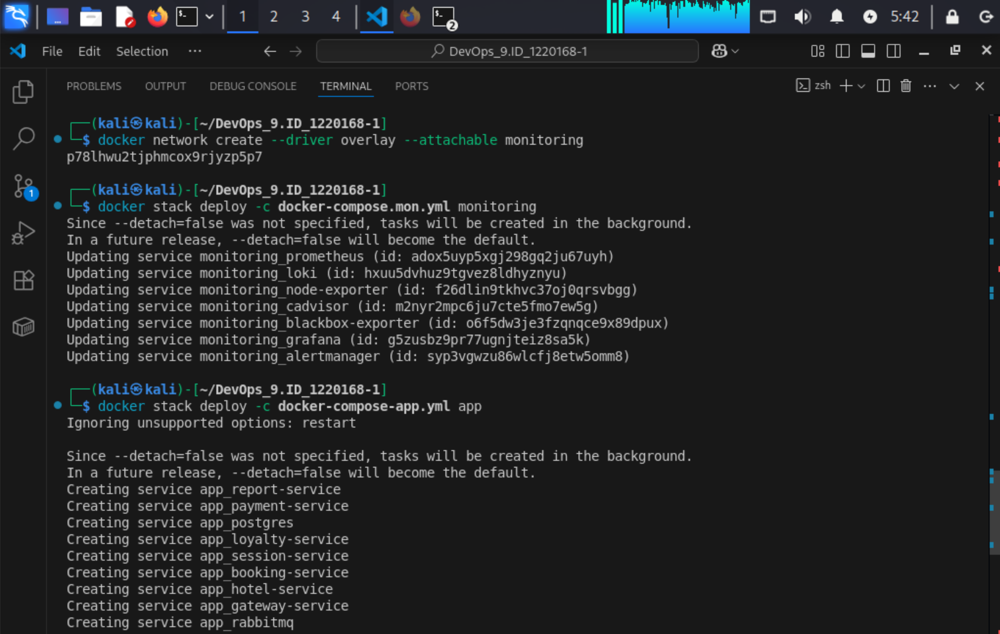
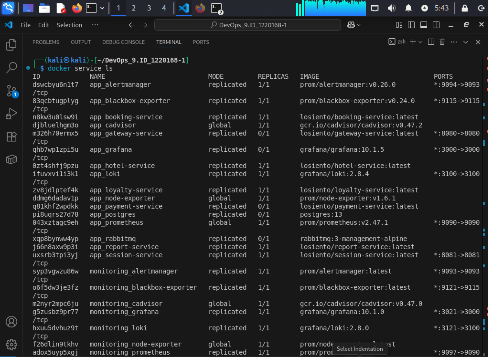
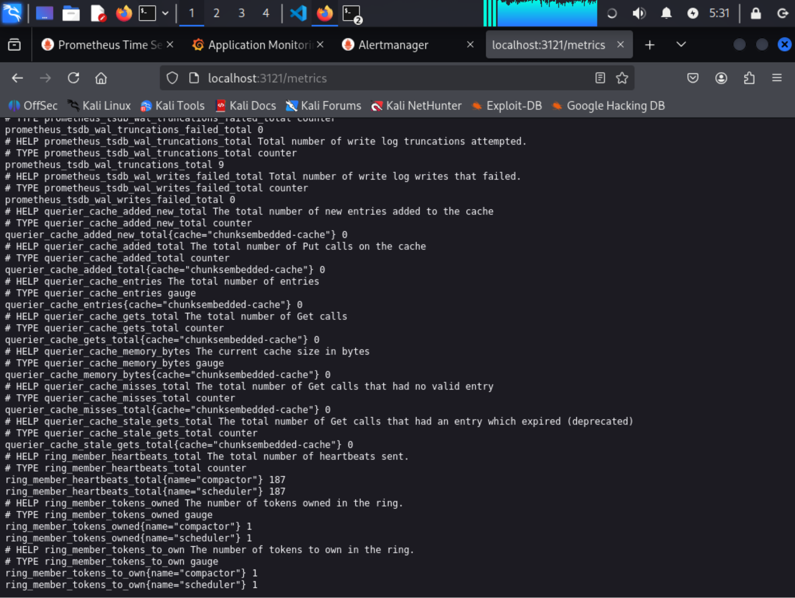
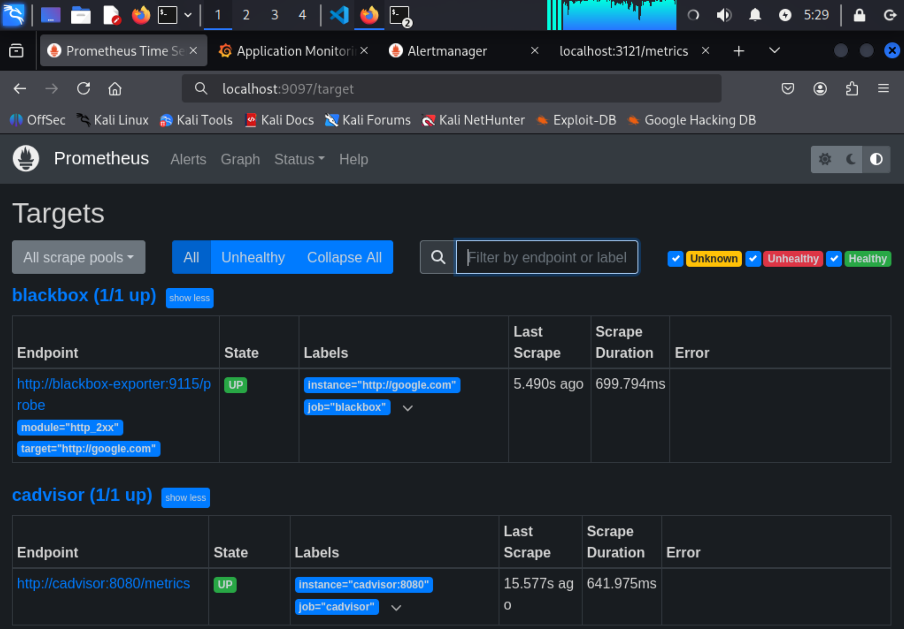
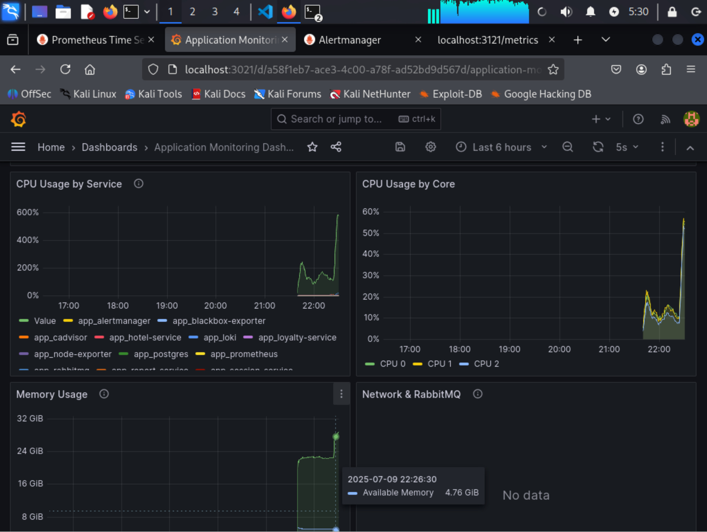
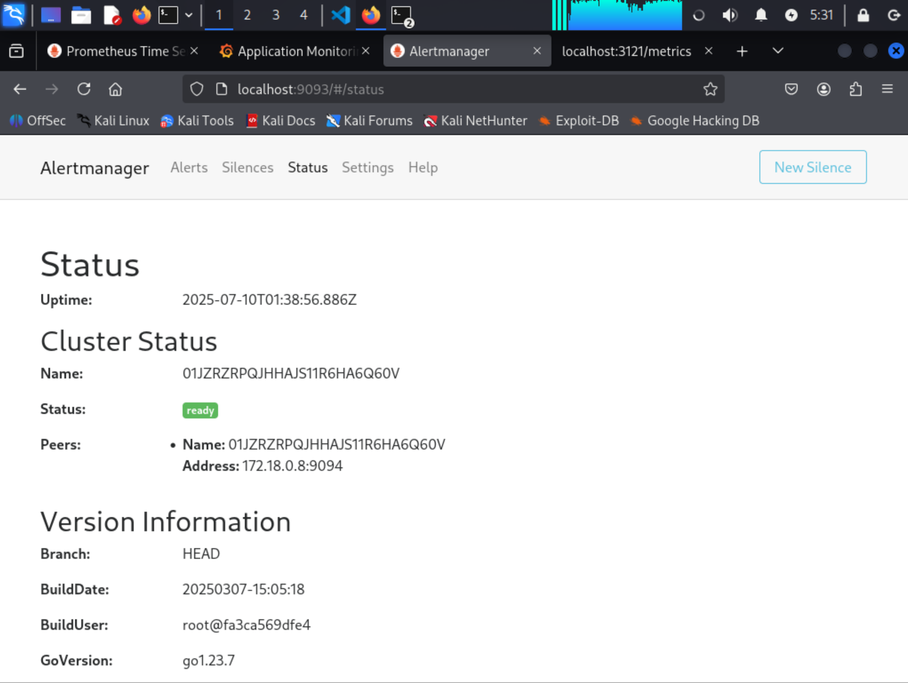
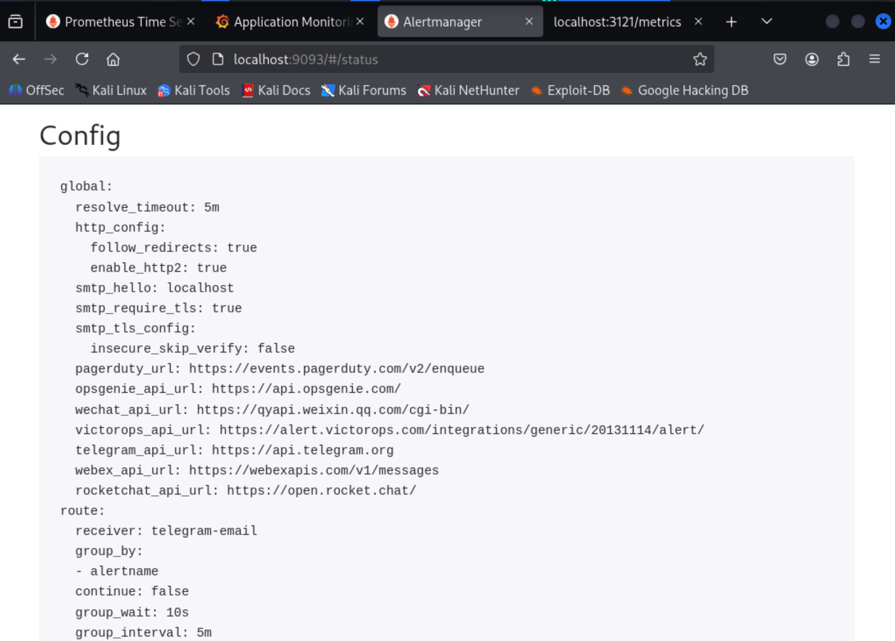

## Part 1. Получение метрик и логов

### Развернул инфраструктуру:

- Создание сети в Docker Swarm:

docker network create --driver overlay --attachable monitoring

- Развертывание стека мониторинга из сервисов с Prometheus Server, Loki, node_exporter, blackbox_exporter, cAdvisor

docker stack deploy -c docker-compose.mon.yml monitoring

- Развертывание стека приложений:

docker stack deploy -c docker-compose-app.yml app

- Проверка статуса сервисов:

docker service ls

- Добавил логи приложения с помощью Loki

- Prometheus

### Реализация метрик в Spring Boot сервисах

- Для каждого сервиса:
- Добавил зависимость в build.gradle

        dependencies {
        implementation 'com.github.loki4j:loki-logback-appender:1.4.0'
        implementation 'org.springframework.boot:spring-boot-starter-actuator'
        implementation 'io.micrometer:micrometer-registry-prometheus'
    }

- Реализовал счетчики метрик: находятся в файле по пути (аналогично для всех сервисов)
    /home/kali/DevOps_9.ID_1220168-1/src/services/booking-service/src/main/java/com/s21/devops/sample/bookingservice/Metrics/BookingMetrics.java

- Инкрементировал счетчики в бизнес-логике: находятся в файле по пути (аналогично для всех сервисов)
    /home/kali/DevOps_9.ID_1220168-1/src/services/booking-service/src/main/java/com/s21/devops/sample/bookingservice/Controller/BookingController.java

## Part 2. Визуализация

- Развернул grafana как новый сервис в стеке мониторинга
- Добавил в grafana дашборд с метриками, импортировав файл json, находящийся по пути:
/home/kali/DevOps_9.ID_1220168-1/grafana/provisioning/dashboards/app_dashboard.json

## Part 3. Отслеживание критических событий

- Развернул alert manager как новый сервис в стеке мониторинга
- Добавил следующие критические события:
    - доступная память меньше 100 мб
    - затраченная RAM больше 1гб
    - использование CPU по сервису превышает 10%
- Настроил получение оповещений через личные email и телеграм

- Полный конфиг находится по пути:
/home/kali/DevOps_9.ID_1220168-1/alertmanager/alertmanager.yml

